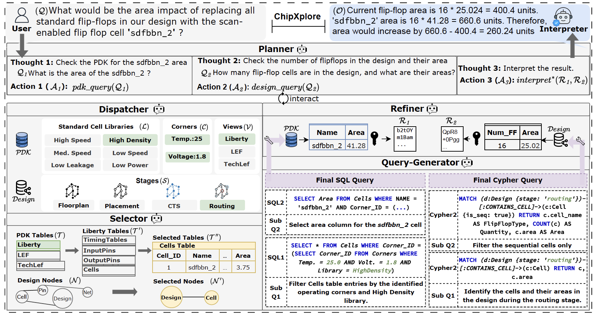

# 🌟 ChipXplore

Natural Language Eploration of Hardware Designs and Libraries

# Overview 

ChipXplore is an LLM-Asissted system for navigating Process Design Kit (PDK) and Hardware Design Data (DEF). 




# Databases 

First, download the [PDK](https://drive.google.com/file/d/1yN6Dg2eOmxtjvx4XOwtDyj6jzX4QXaSM/view?usp=sharing) DB and [Design](https://drive.google.com/file/d/1OzVlmC4JAPtuAeO8DH42_V4UtR5k-PgY/view?usp=sharing) DB. 

Place the PDK database under `./dbs`

Make sure you can connect to dbs correctly. View SQL DB in browser: 

```
sqlite_web ./dbs/sky130_index.db 
```


Extract the design database and place it under `./data/daatabases/`

Make sure that you have neo4j server installed. Start the neo4j server using docker as follows: 

```
docker run --name neo4j-apoc -p 7474:7474 -p 7687:7687 -e NEO4J_AUTH=neo4j/your_password -e NEO4J_apoc_export_file_enabled=true -e NEO4J_apoc_import_file_enabled=true -e NEO4J_apoc_import_file_use__neo4j__config=true -e NEO4JLABS_PLUGINS='["apoc"]' --user $(id -u):$(id -g) -v $(pwd)/neo4j.conf:/conf/neo4j.conf -v $(pwd)/output:/var/lib/neo4j/import -v $PWD/data:/data -v $PWD/plugins:/plugins neo4j:4.4 2>&1 | tee neo4j_docker.log
```

# Model API keys 

Fill in your API keys in the [.env](.env) file 

# Running Instructions 

Run PDK workflow: 

```
python core/graph_flow/pdk_flow.py --model <model-name>
```

Run Design workflow: 

```
python core/graph_flow/design_flow.py --model <model-name>
```

Run the entire framework: 

```
python core/runner.py --model <model-name>
```


# Citation

```
@INPROCEEDINGS{abdelatty2025chipxplore,
author={M. {Abdelatty} and J. K {Rosenstein} and S. {Reda}},
    booktitle={IEEE International Conference on LLM-Aided Design (LAD), 2025},
    title={ChipXplore: Natural Language Exploration of Hardware Designs and Libraries},
    year={2025},
    volume={},
    number={},
}
```