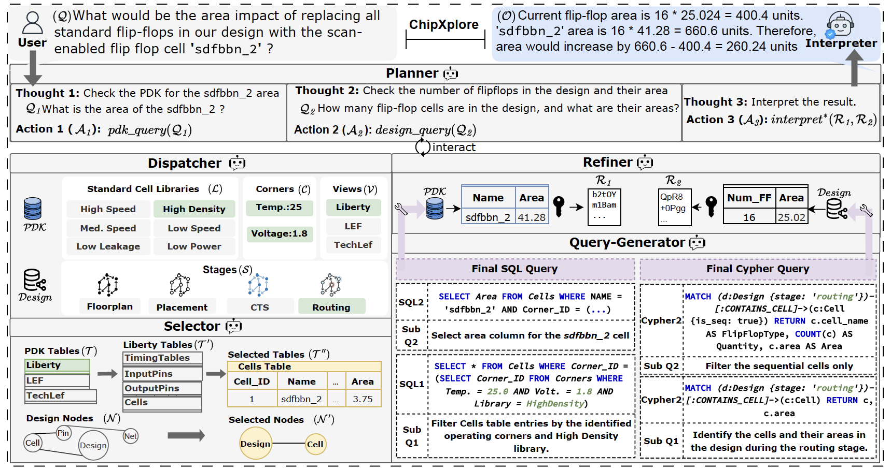

# 🌟 ChipXplore

Natural Language Eploration of Hardware Designs and Libraries

# Overview 

ChipXplore is an LLM-Asissted system for navigating Process Design Kit (PDK) and Hardware Design Data (DEF). 




## 🗄️ Databases

### Download Pre-built Databases 

ChipXplore uses two databases:

| Database | Engine | Location | Contents |
|----------|--------|----------|----------|
| PDK | SQLite | `dbs/sky130_index.db` | Standard-cell library (LEF/TechLEF/Liberty) data |
| Design | Neo4j **4.4** graph | `data/databases/sky130pico/` | Placed-and-routed design graph (~600k nodes) |

Download the prebuilt databases:

- **PDK DB:** <https://drive.google.com/file/d/1yN6Dg2eOmxtjvx4XOwtDyj6jzX4QXaSM/view?usp=sharing>
- **Design DB:** <https://drive.google.com/file/d/1OzVlmC4JAPtuAeO8DH42_V4UtR5k-PgY/view?usp=sharing>

Place the PDK database under `./dbs/` and extract the design database under
`./data/databases/` (so you end up with `./data/databases/sky130pico/`).

You can sanity-check the SQL DB in a browser:

```bash
sqlite_web ./dbs/sky130_index.db
```

> ⚠️ **The prebuilt design graph is a Neo4j 4.4 store.** Its on-disk format is
> **not** compatible with Neo4j 5.x / 2025+ / calendar-versioned releases. You
> must serve it with a Neo4j **4.4** server, or migrate the store first. Trying
> to open it with a newer Neo4j fails with store-format / incompatibility errors.

The Neo4j connection parameters the code expects are defined in
`core/database/graphdb.py`:

```
URI      = bolt://localhost:7687
USER     = neo4j
PASSWORD = your_password
```

If your server differs, either match these values or edit that file.

Make sure that you have neo4j server installed. You can start the neo4j server using docker as follows: 

```
docker run --name neo4j-apoc -p 7474:7474 -p 7687:7687 -e NEO4J_AUTH=neo4j/your_password -e NEO4J_apoc_export_file_enabled=true -e NEO4J_apoc_import_file_enabled=true -e NEO4J_apoc_import_file_use__neo4j__config=true -e NEO4JLABS_PLUGINS='["apoc"]' --user $(id -u):$(id -g) -v $(pwd)/neo4j.conf:/conf/neo4j.conf -v $(pwd)/output:/var/lib/neo4j/import -v $PWD/data:/data -v $PWD/plugins:/plugins neo4j:4.4 2>&1 | tee neo4j_docker.log
```

###  Build Your Own PDK SQL Database 

You can run the following to build your own SQL database:  

```
export PDK_ROOT=/path/to/pdks  # points to skywater PDK root sky130A/
python -m core.database.sql --pdk_name sky130 --output_dir ./dbs
```

### Build Your Own Design Graph Database

Build the design graph in two steps: use OpenROAD to parse design snapshots into
CSV files, then load those files into Neo4j. This requires the original design
files and matching PDK files, not just the PDK SQL database.

**1. Prepare the inputs and OpenROAD environment.**

Install OpenROAD with Python support (`odb` and `openroad`) and make the Python
dependencies in `requirements.txt` available to its Python interpreter. Run the
parsing work in a compute allocation on HPC systems.

Organize the design snapshots by stage. Each stage needs one DEF and one SDC;
SPEF is optional and is read when present:

```text
designs/my-design/
├── floorplan/   # *.def, *.sdc, optional *.spef
├── placement/   # *.def, *.sdc, optional *.spef
├── cts/         # *.def, *.sdc, optional *.spef
└── routing/    # *.def, *.sdc, optional *.spef
```

The parser picks the first matching file in each directory. Its current PDK
selection is hard-coded to `sky130_fd_sc_hd`, with Liberty files from `lib/`,
nominal Technology LEF from `techlef/`, and cell LEF from `lef/`. Adjust those
selections in `core/parsers/design/design_parser.py` for another library or PDK,
and ensure the selected files are readable by OpenROAD.

**2. Export one stage at a time.**

Run from the repository root. Unlike the SQL builder, the design parser's
`--pdk` argument directly specifies the `libs.ref` directory:

```bash
export PDK_ROOT=/path/to/pdks
export PYTHONPATH="$PWD${PYTHONPATH:+:$PYTHONPATH}"

openroad -exit -python core/parsers/design/design_parser.py \
  --input ./designs/my-design \
  --pdk "$PDK_ROOT/sky130A/libs.ref" \
  --stage routing \
  --format load \
  --output_dir ./output/routing
```

Repeat for `floorplan`, `placement`, and `cts`, changing both `--stage` and the
output subdirectory. Always specify a stage: the parser's multi-stage mode
reuses the output directory and can overwrite earlier CSV files. Direct script
execution through OpenROAD is intentional here; `PYTHONPATH` makes the
repository's `core` imports available.

Each output directory contains `designs.csv`, `cells.csv`, `pins.csv`,
`nets.csv`, `segment.csv`, `ioports.csv`, and `edges.csv`, plus relationship files
such as `CONTAINS_CELL.csv`. Node IDs include the stage to distinguish snapshots.
Check that parsing completed and the CSV files contain data before loading.
The current parser assumes nonempty ports, cells, pins, nets, and segments when
constructing CSV headers; designs without those objects may need parser changes.

**3. Load the CSV files into a fresh Neo4j database.**

Start Neo4j 4.4 with APOC and the connection credentials documented above. Use a
fresh database whose name matches `DatabaseConfig` (`sky130pico` by default).
The loader uses sessions without an explicit database name, so the connected
user's default database must also be that database.

For Docker, mount `./output` at `/var/lib/neo4j/import`, as in the Docker command
above. For a native server, copy the stage directories under its configured
import directory. Enable CSV file imports and APOC in the server configuration.

Before using the current `core/database/graphdb.py` loader, adapt its CSV URLs
to the configured import root: replace
`file:///var/lib/neo4j/import/{stage}/%s` with `file:///{stage}/%s` in the node
loader, edge loader, and mismatched-ID check. For example,
`file:///routing/cells.csv` should resolve to `routing/cells.csv` under the
server's import directory. Also check that the constraint in
`load_nodes_and_relationships` is supported by your Neo4j edition; for the
exported stage-qualified IDs, a single-property uniqueness constraint on
`Design.id` can replace the composite `(id, stage)` constraint.

After those adjustments, load the stages you exported from the repository root:

```bash
python - <<'PYTHON'
from core.database.graphdb import Neo4jConnection

conn = Neo4jConnection()
try:
    conn.test_connection()
    for stage in ["routing"]:  # Add other stages after exporting their CSVs.
        conn.load_nodes_and_relationships(
            stage,
            "cells.csv", "pins.csv", "nets.csv", "segment.csv",
            "edges.csv", "designs.csv", "ioports.csv",
        )
finally:
    conn.close()
PYTHON
```

The loader uses `CREATE`; repeating an import is not an incremental update and
can create duplicates or constraint errors. The convenience wrapper
`core/parsers/design/run.py` calls `clear_database()` before loading, contains a
machine-specific Python path, and expects JSON output that the parser does not
currently emit. Do not use it against an existing graph you want to retain.

The alternative `--format bulk` produces node headers for `neo4j-admin import`.
The wrapper's `--use_bulk_import` path needs separate adaptation: it assumes a
Docker container named `neo4j-apoc`, targets `sky130` instead of `sky130pico`,
and does not manage the offline import lifecycle. Its post-import property
conversion and index helpers also invoke Docker. The steps above use the CSV
loader instead; this documentation does not repair those scripts.

**4. Verify the graph.**

Run these queries in Neo4j Browser or `cypher-shell` against the target database:

```cypher
MATCH (d:Design)
OPTIONAL MATCH (d)-[:CONTAINS_CELL]->(c:Cell)
RETURN d.name, d.stage, count(c) AS cells;

MATCH ()-[r]->()
RETURN type(r) AS relationship, count(*) AS total;
```

Confirm the expected stages and compare cell counts with the source design.
Only ask stage-specific questions about snapshots you imported. If you choose a
different database name, update `DatabaseConfig` in `config/config.py` as well.


# Model API keys 

Fill in your API keys in the [.env](.env) file 

# Dependecies 


### 1. Python environment

Use Python **3.10+** in an isolated environment, then install pinned deps:

```bash
pip install -r requirements.txt
```

### 2. Local LLM (Ollama)

The default model is `llama3.1`, served locally by [Ollama](https://ollama.com):

```bash
ollama pull llama3.1
ollama list          # confirm llama3.1 is present
```

Ollama must be running when you invoke ChipXplore. Other models are supported —
see [Model options](#-model-options).

### 3. Neo4j 4.4 the native way (no Docker)

The upstream project used a Docker image (`neo4j:4.4`, see `neo4j.sh`). You can
also run Neo4j 4.4 **natively**. This avoids Docker entirely.

**Java:** Neo4j 4.4 requires **Java 11** (Java 17 works but prints an
"unsupported runtime" warning). It does **not** run on Java 21. Point `JAVA_HOME`
at a JDK 11 install for all Neo4j commands below.

```bash
# a) Download & extract Neo4j 4.4 Community (self-contained, no install needed)
mkdir -p ~/neo4j-chipxplore && cd ~/neo4j-chipxplore
curl -fLO https://dist.neo4j.org/neo4j-community-4.4.42-unix.tar.gz
tar -xzf neo4j-community-4.4.42-unix.tar.gz
NEO=~/neo4j-chipxplore/neo4j-community-4.4.42

# b) Put the prebuilt sky130pico store into this server's data dir
cp -R /path/to/ChipXplore/data/databases/sky130pico "$NEO/data/databases/"
rm -f "$NEO/data/databases/sky130pico/database_lock"     # drop any stale lock

# c) Enable APOC (bundled in labs/) — used for graph schema introspection
cp "$NEO/labs/"apoc-*-core.jar "$NEO/plugins/"

# d) Configure the server
cat >> "$NEO/conf/neo4j.conf" <<'EOF'

# ===== ChipXplore =====
dbms.default_database=sky130pico
dbms.default_listen_address=localhost
dbms.security.procedures.unrestricted=apoc.*
dbms.security.procedures.allowlist=apoc.*,gds.*
apoc.export.file.enabled=true
apoc.import.file.enabled=true
apoc.import.file.use_neo4j_config=true
# The prebuilt store ships without transaction logs; allow it to start anyway.
dbms.recovery.fail_on_missing_files=false
EOF

# e) Set the password BEFORE the first start (must match graphdb.py)
export JAVA_HOME=$(/usr/libexec/java_home -v 11)   # macOS; else set JDK 11 path
"$NEO/bin/neo4j-admin" set-initial-password your_password

# f) Start the server
"$NEO/bin/neo4j" start
```

Verify it is up and the graph is loaded:

```bash
export JAVA_HOME=$(/usr/libexec/java_home -v 11)
"$NEO/bin/cypher-shell" -a bolt://localhost:7687 -u neo4j -p your_password \
  -d system "SHOW DATABASES YIELD name, currentStatus;"
"$NEO/bin/cypher-shell" -a bolt://localhost:7687 -u neo4j -p your_password \
  -d sky130pico "MATCH (n) RETURN count(n);"      # expect ~608k nodes
```

To stop the server later:

```bash
export JAVA_HOME=$(/usr/libexec/java_home -v 11)
~/neo4j-chipxplore/neo4j-community-4.4.42/bin/neo4j stop
```

> Why `dbms.recovery.fail_on_missing_files=false`? The exported store was copied
> without its transaction logs. Without this flag Neo4j 4.4 refuses to start the
> database with `Transaction logs are missing and recovery is not possible`. The
> flag lets Neo4j create fresh logs from the store — safe for a read-only,
> cleanly-exported dataset like this.

**Alternative:** if you prefer Docker, the original one-liner still works:

```bash
bash neo4j.sh   # runs neo4j:4.4 in Docker (see the script)
```

### 4. Environment variables (`.env`)

Copy/complete the `.env` file at the repo root. Which keys you need depends on
how you run ChipXplore:

```dotenv
# LangSmith — ONLY needed for the evaluation harness (core/runner.py).
# Set to false when running the direct query script (query_chip.py).
LANGCHAIN_TRACING_V2=false
LANGCHAIN_ENDPOINT=https://api.smith.langchain.com
LANGCHAIN_API_KEY=          # required only for core/runner.py

# LLM providers — only needed if you use those models.
OPENAI_API_KEY=             # NOT required when using local Ollama + local embeddings
DEEPSEEK_API_KEY=
```

# Running Instructions 


Run PDK workflow: 

```
python core/graph_flow/pdk_flow.py --model <model-name>
```

Run Design workflow: 

```
python core/graph_flow/design_flow.py --model <model-name>
```

Run the entire framework: 

```
python core/runner.py --model <model-name>
```

##  Model options

`--model` accepts (see `core/agents/agent.py` for the full lists):

- **Ollama (local):** `llama3.1`, `llama3.3:70b`, `deepseek-r1:70b`, … (must be
  pulled via `ollama pull`)
- **OpenAI:** `gpt-4o-2024-05-13`, `gpt-4o-mini-2024-07-18`, `gpt-3.5-turbo`, …
  (needs `OPENAI_API_KEY`)
- **DeepSeek:** `deepseek-chat`, `deepseek-reasoner` (needs `DEEPSEEK_API_KEY`)
- **HuggingFace / fine-tuned:** `chipxplore-lef`, `chipxplore-tlef`,
  `chipxplore-lib`, and various `meta-llama/*` models


# Citation

```
@INPROCEEDINGS{abdelatty2025chipxplore,
author={M. {Abdelatty} and J. K {Rosenstein} and S. {Reda}},
    booktitle={IEEE International Conference on LLM-Aided Design (LAD), 2025},
    title={ChipXplore: Natural Language Exploration of Hardware Designs and Libraries},
    year={2025},
    volume={},
    number={},
}
```